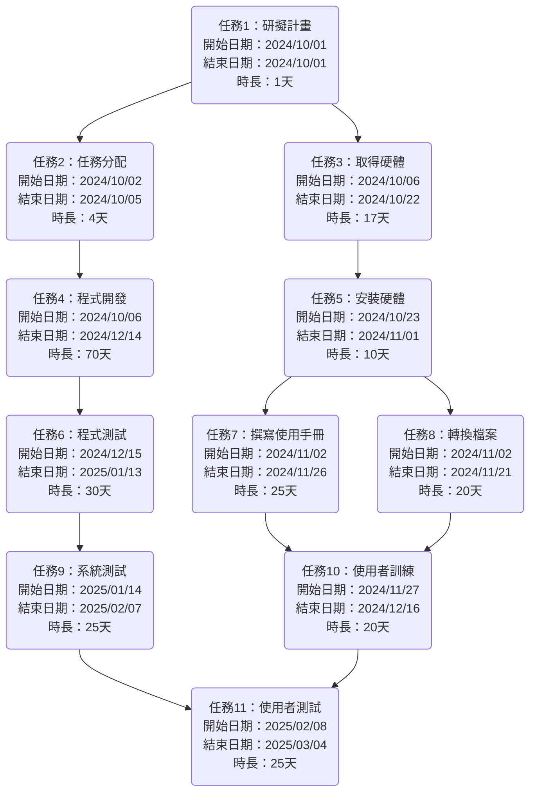
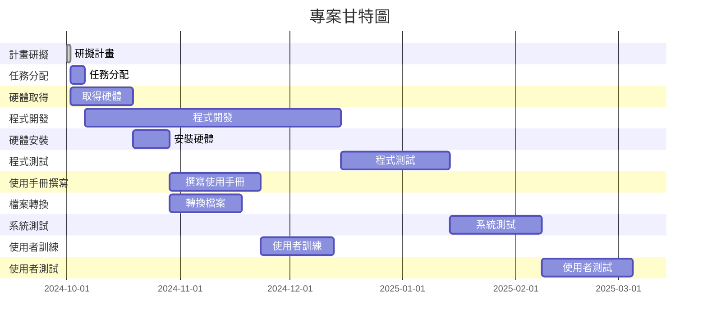

# hw02

## 工作分解結構清單
| 任務 | 說明        | 需時 (天) | 前置任務  |
| :----: | :-----------: | :---------: | :---------: |
| 1    | 研擬計畫    | 1         | -         |
| 2    | 任務分配    | 4         | 1         |
| 3    | 取得硬體    | 17        | 1         |
| 4    | 程式開發    | 70        | 2         |
| 5    | 安裝硬體    | 10        | 3         |
| 6    | 程式測試    | 30        | 4         |
| 7    | 撰寫使用手冊| 25        | 5         |
| 8    | 轉換檔案    | 20        | 5         |
| 9    | 系統測試    | 25        | 6         |
| 10   | 使用者訓練  | 20        | 7,8       |
| 11   | 使用者測試  | 25        | 9,10      |


## PERT/CPM圖


## 甘特圖



## 關鍵路徑圖

```mermaid
graph TD;
    A1[研擬計畫] --> A2[任務分配];
    A1 --> A3[取得硬體];
    A2 --> A4[程式開發];
    A3 --> A5[安裝硬體];
    A4 --> A6[程式測試];
    A5 --> A7[撰寫使用手冊];
    A5 --> A8[轉換檔案];
    A6 --> A9[系統測試];
    A7 --> A10[使用者訓練];
    A8 --> A10;
    A9 --> A11[使用者測試];
    A10 --> A11;
   
    style A1 fill:#f9f,stroke:#333,stroke-width:2px;
    style A2 fill:#f9f,stroke:#333,stroke-width:2px;
    style A4 fill:#f9f,stroke:#333,stroke-width:2px;
    style A6 fill:#f9f,stroke:#333,stroke-width:2px;
    style A9 fill:#f9f,stroke:#333,stroke-width:2px;
    style A11 fill:#f9f,stroke:#333,stroke-width:2px;

