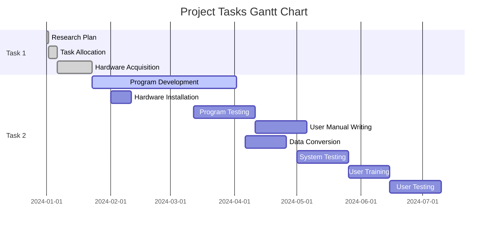

# hw02

# Let's first define the tasks with their durations and dependencies for CPM/PERT analysis
import networkx as nx

# Tasks data: Task number, duration (in days), prerequisites (list of task numbers)
tasks = {
    1: {'duration': 1, 'prerequisites': []},
    2: {'duration': 4, 'prerequisites': [1]},
    3: {'duration': 17, 'prerequisites': [1]},
    4: {'duration': 70, 'prerequisites': [2]},
    5: {'duration': 10, 'prerequisites': [3]},
    6: {'duration': 30, 'prerequisites': [4]},
    7: {'duration': 25, 'prerequisites': [5]},
    8: {'duration': 20, 'prerequisites': [5]},
    9: {'duration': 25, 'prerequisites': [6]},
    10: {'duration': 20, 'prerequisites': [7, 8]},
    11: {'duration': 25, 'prerequisites': [9, 10]}
}

# Create a directed graph for PERT/CPM
G = nx.DiGraph()

# Add tasks as nodes and their dependencies as edges
for task, data in tasks.items():
    G.add_node(task, duration=data['duration'])
    for prereq in data['prerequisites']:
        G.add_edge(prereq, task)

# Now, we will compute the longest path (critical path) using networkx's built-in function.
# This will also serve as the Critical Path Method (CPM) result.
critical_path = nx.dag_longest_path(G, weight='duration')
critical_path_length = nx.dag_longest_path_length(G, weight='duration')

# We will visualize the PERT/CPM network and the Gantt chart for these tasks next.
# First, let's return the critical path and its length.
critical_path, critical_path_length
